# PES-VCS Lab Report

**Name:** T S Sathya Kiran  
**SRN:** PES2UG24CS547  
**Repository:** PES2UG24CS547-pes-vcs  
**Platform:** Fedora Linux  

---

## Table of Contents

1. [Phase 1: Object Storage](#phase-1-object-storage)
2. [Phase 2: Tree Objects](#phase-2-tree-objects)
3. [Phase 3: The Index (Staging Area)](#phase-3-the-index-staging-area)
4. [Phase 4: Commits and History](#phase-4-commits-and-history)
5. [Final Integration Test](#final-integration-test)
6. [Phase 5: Branching and Checkout (Analysis)](#phase-5-branching-and-checkout-analysis)
7. [Phase 6: Garbage Collection (Analysis)](#phase-6-garbage-collection-analysis)

---

## Phase 1: Object Storage

**Concepts:** Content-addressable storage, directory sharding, atomic writes, SHA-256 integrity.

**What was implemented:** `object_write` and `object_read` in `object.c`.

- `object_write` prepends a type header (`"blob <size>\0"`, `"tree <size>\0"`, or `"commit <size>\0"`), computes SHA-256 of the full object (header + data), shards the file into `.pes/objects/XX/` using the first two hex characters of the hash, and writes atomically using a temp file + `fsync` + `rename`.
- `object_read` reads the stored file, verifies integrity by recomputing SHA-256 and comparing it to the expected hash from the filename, parses the type header, and returns the data portion.
- Deduplication is implemented by checking `object_exists` before writing — if the same content is added twice, only one file is stored.

### Screenshot 1A — `./test_objects` passing all tests

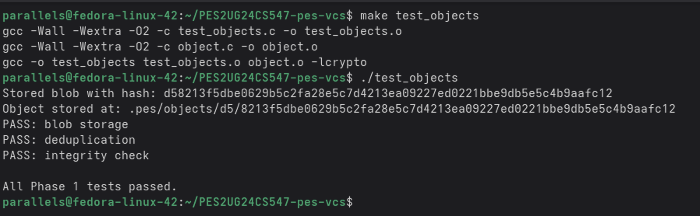

All three tests pass:
- **blob storage** — write and read back a blob, content matches
- **deduplication** — same content produces same hash, stored once
- **integrity check** — corrupted object is detected and rejected

### Screenshot 1B — Sharded object store directory structure

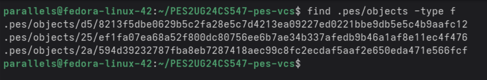

Objects are stored under `.pes/objects/XX/YYY...` where `XX` is the first two hex characters of the SHA-256 hash. This sharding avoids large flat directories and mirrors Git's real object store layout.

---

## Phase 2: Tree Objects

**Concepts:** Directory representation as linked structures, recursive tree building, file modes and permissions.

**What was implemented:** `tree_from_index` in `tree.c`. (`tree_parse` and `tree_serialize` were provided.)

- `tree_from_index` loads the index, sorts entries by path, then calls a recursive helper `write_tree_level` that groups entries by their first path component.
- Flat files (no `/` in remaining path) become direct blob entries in the current tree.
- Entries with a `/` belong to a subdirectory — the helper groups all such entries under the same prefix and recurses, producing a subtree object, then adds a directory entry pointing to that subtree's hash.
- Each tree level is serialized with `tree_serialize` and written to the object store with `object_write(OBJ_TREE, ...)`.

### Screenshot 2A — `./test_tree` passing all tests

**Build output:**

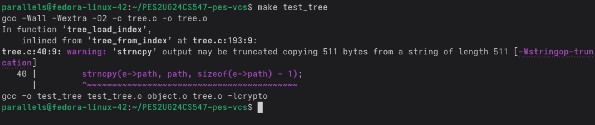

**Test output:**

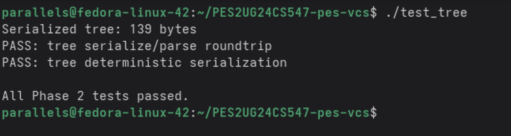

Both tests pass:
- **tree serialize/parse roundtrip** — entries survive serialize → parse with modes and hashes intact, and are sorted by name
- **tree deterministic serialization** — same entries in any input order produce identical binary output

### Screenshot 2B — Raw binary of an object file (`xxd`)

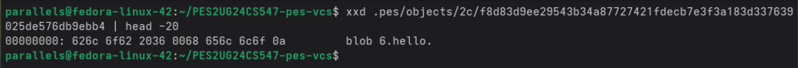

The raw object shows the header `blob 6.hello.` — the format is `"<type> <size>\0<data>"`. The null byte separator between the header and content is visible as `00` in the hex dump. This is the exact same format Git uses for blob objects.

---

## Phase 3: The Index (Staging Area)

**Concepts:** Staging area as a text file, atomic writes with temp-file + rename, fast change detection using metadata.

**What was implemented:** `index_load`, `index_save`, and `index_add` in `index.c`.

- `index_load` reads `.pes/index` line by line using `fscanf`. If the file doesn't exist (first run), it initializes an empty index — this is not an error.
- `index_save` heap-allocates a sorted copy of the index (the struct is ~5MB, too large for the stack), sorts entries by path with `qsort`, writes to a `.pes/index.tmp` file, calls `fsync` to flush to disk, then atomically `rename`s it over the real index file.
- `index_add` reads the file contents, writes them as a blob via `object_write(OBJ_BLOB, ...)`, reads file metadata with `lstat` (mode, mtime, size), and either updates an existing entry (found via `index_find`) or appends a new one, then calls `index_save`.

### Screenshot 3A — `pes init` → `pes add` → `pes status`

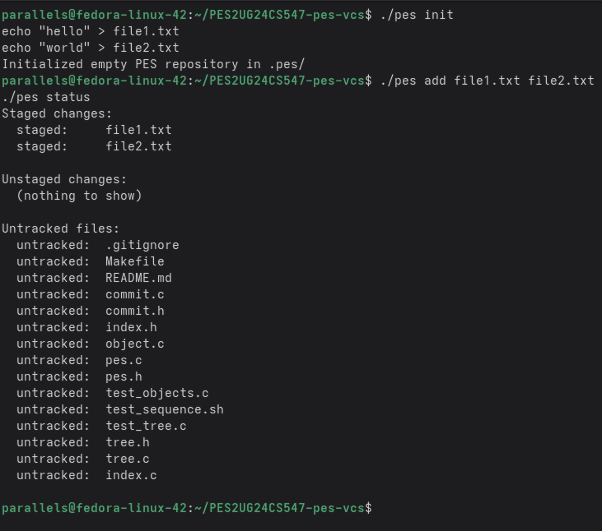

Both `file1.txt` and `file2.txt` appear under "Staged changes". Unstaged changes and untracked files both show "(nothing to show)" since all present files were just staged.

### Screenshot 3B — `cat .pes/index` showing text-format entries

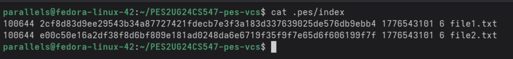

Each line contains the octal mode, 64-character SHA-256 hex hash, mtime timestamp, file size in bytes, and the file path — all as human-readable text. The format is intentionally simple and inspectable without any binary parsing tools.

---

## Phase 4: Commits and History

**Concepts:** Linked commit structures on disk, reference files, atomic pointer updates, HEAD and branch refs.

**What was implemented:** `commit_create` in `commit.c`. (`commit_parse`, `commit_serialize`, `commit_walk`, `head_read`, and `head_update` were provided.)

- `commit_create` calls `tree_from_index` to snapshot the current staged state into a tree object hierarchy.
- It attempts `head_read` to find the parent commit — if HEAD has no commits yet (empty repo), `has_parent` is set to 0.
- The author string comes from `pes_author()` which reads the `PES_AUTHOR` environment variable, and the timestamp from `time(NULL)`.
- The filled `Commit` struct is serialized with `commit_serialize` and written as `OBJ_COMMIT` via `object_write`.
- Finally, `head_update` atomically writes the new commit hash to the branch ref file (`.pes/refs/heads/main`), using the same temp-file + rename pattern.

### Screenshot 4A — `./pes log` showing three commits

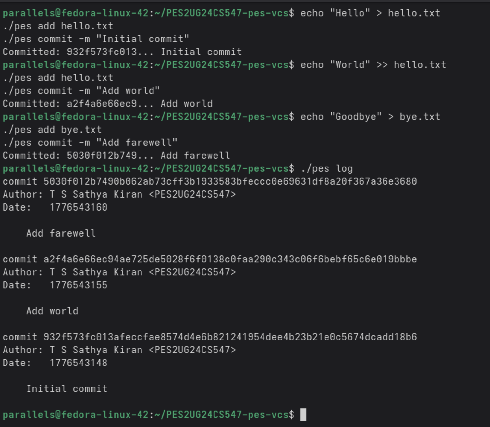

Three commits are shown newest-first, each with a full 64-character SHA-256 hash, the author `T S Sathya Kiran <PES2UG24CS547>`, a Unix timestamp, and the commit message. The parent chain is correctly traversed by `commit_walk`.

### Screenshot 4B — `find .pes -type f | sort` showing object growth

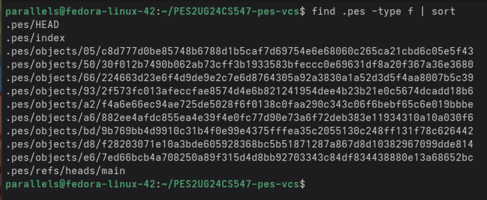

After three commits, 10 objects have been created: blobs (file contents), trees (directory snapshots), and commits (metadata + pointers). The `.pes/index` and `.pes/refs/heads/main` ref files are also visible. Unchanged file contents are deduplicated — `hello.txt` v1 and v2 are separate blobs but the unchanged `bye.txt` blob is reused.

### Screenshot 4C — Reference chain (`cat .pes/refs/heads/main` and `cat .pes/HEAD`)

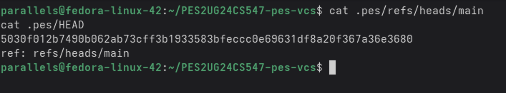

`.pes/refs/heads/main` contains the hash of the latest commit. `.pes/HEAD` contains `ref: refs/heads/main`, the symbolic reference. When `head_read` is called, it follows this indirection: reads HEAD → finds `ref: refs/heads/main` → reads that file → gets the actual commit hash.

---

## Final Integration Test

### Screenshot — `make test-integration` (part 1)

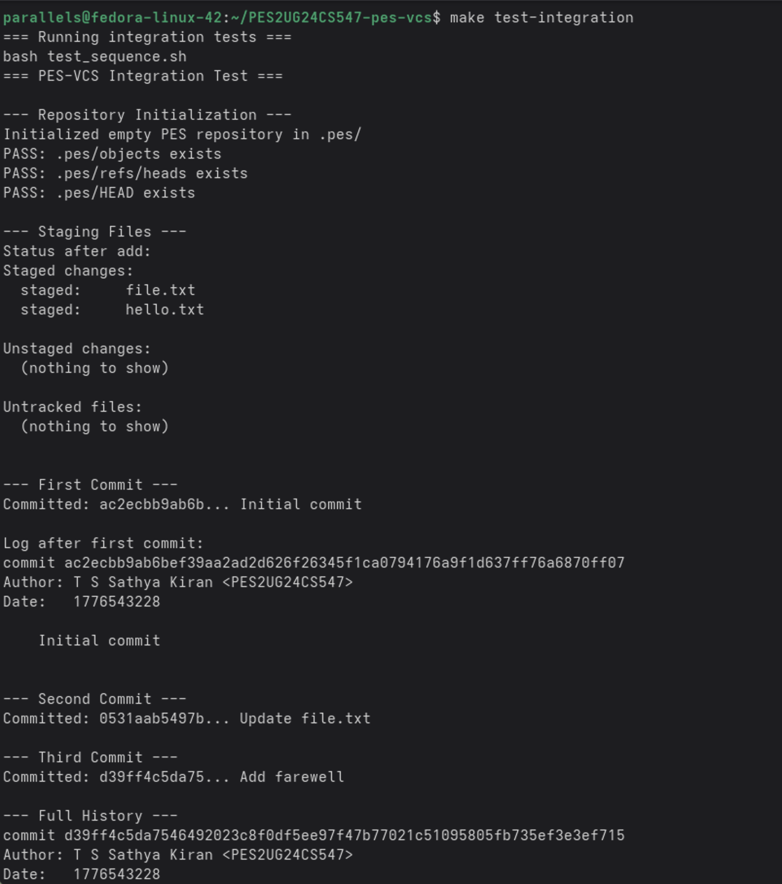

### Screenshot — `make test-integration` (part 2)

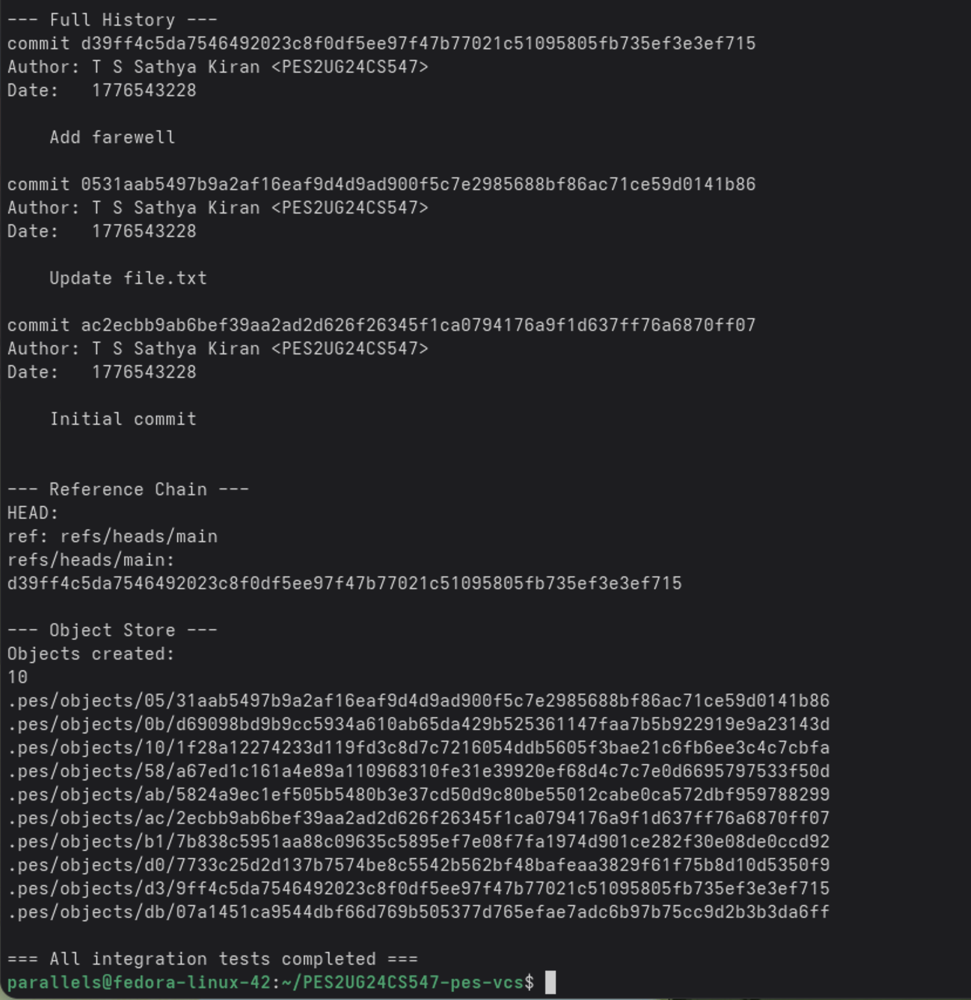

The full end-to-end integration test (`test_sequence.sh`) passes completely:
- Repository initialization creates all required `.pes/` directories and `HEAD`
- Staging files and checking status works correctly
- Three sequential commits are created with correct hashes and log output
- The full history is displayed correctly newest-to-oldest
- The reference chain (`HEAD` → `refs/heads/main` → commit hash) is correct
- 10 objects were created across 3 commits, matching the expected blob + tree + commit structure
- Final line: `=== All integration tests completed ===`

---

## Phase 5: Branching and Checkout (Analysis)

### Q5.1 — How would you implement `pes checkout <branch>`?

A branch in PES-VCS is a file at `.pes/refs/heads/<branch>` containing a commit hash. To implement `pes checkout <branch>`, the following steps are needed:

First, read the target branch file to get its commit hash, then read that commit object to get its root tree hash. Next, walk the working directory and index to detect any uncommitted changes that would conflict with the checkout (see Q5.2). If no conflicts exist, recursively walk the target tree object and write each blob's content to the corresponding file path in the working directory — creating any missing directories as needed, and deleting any tracked files from the current branch that don't exist in the target tree. Finally, update `.pes/HEAD` to contain `ref: refs/heads/<branch>` and reload the index to match the new tree's state.

The complexity comes from several factors. Files that exist in the current branch but not the target must be deleted. Files that exist in both branches but differ must be overwritten. Nested subdirectories must be created or removed as the tree structure changes. The operation must be atomic enough that a failure halfway through doesn't leave the working directory in a broken mixed state — unlike a single-file rename, updating dozens of working directory files is not inherently atomic.

### Q5.2 — Detecting dirty working directory conflicts

To detect a conflict before allowing checkout, the following check is performed for each file tracked in the current index:

Compare the file's current on-disk `mtime` and `size` (from `lstat`) against the values stored in the index entry. If they differ, the file has been modified since it was last staged — this is an unstaged modification. Also check whether the index entry's hash matches the HEAD tree's hash for that path — if they differ, the file has been staged but not committed.

If the target branch's tree has a different blob hash for any of these dirty files, checkout must refuse. The check uses only the index (for staged state) and the object store (to look up the target tree's version of each file) — no diff of actual file content is needed, just hash comparison. Files that are dirty but whose path doesn't exist in the target branch are also a conflict, since checkout would need to delete them.

### Q5.3 — Detached HEAD state

Detached HEAD occurs when `.pes/HEAD` contains a raw commit hash directly instead of `ref: refs/heads/<branch>`. This happens when you explicitly checkout a specific commit hash rather than a branch name.

In this state, new commits are created and HEAD is updated to point to them directly — but no branch ref file is updated. The commits exist in the object store and are reachable from HEAD, but once you switch away (checkout another branch), HEAD stops pointing to them and they become unreachable from any named reference.

To recover those commits, a user would need to remember (or find in a log) the commit hash they were on before switching. They could then create a new branch pointing to that hash: `pes checkout -b recovery-branch <hash>` — which would create `.pes/refs/heads/recovery-branch` containing that hash, making the commits reachable again. In real Git, `git reflog` keeps a history of where HEAD has pointed, making recovery straightforward. Without a reflog, the only option is searching the object store for commit objects whose hashes you can identify.

---

## Phase 6: Garbage Collection (Analysis)

### Q6.1 — Algorithm to find and delete unreachable objects

The algorithm is a mark-and-sweep over the object graph:

**Mark phase:** Start from every branch ref file in `.pes/refs/heads/` and the current HEAD. For each commit hash found, read the commit object and mark it reachable. Follow its `tree` pointer — read the tree object and mark it reachable, then recursively mark every entry in the tree: blob entries are marked directly, subtree entries are recursed into. Follow the `parent` pointer and repeat the entire process for the parent commit, continuing until a commit with no parent is reached. Use a hash set (e.g. a hash table keyed on the 32-byte ObjectID) to track all reachable hashes and avoid revisiting objects.

**Sweep phase:** Walk every file in `.pes/objects/XX/YYY...` using `find` or `opendir`/`readdir`. Reconstruct the full hash from the directory name and filename. If the hash is not in the reachable set, delete the file. After deleting all unreachable objects, remove any now-empty shard directories.

For a repository with 100,000 commits and 50 branches, estimating objects to visit: each commit typically touches ~5–20 files (blobs) and ~3–5 tree objects. Assuming an average of 10 unique objects per commit with reasonable deduplication across commits, a rough estimate is 100,000 × 10 = 1,000,000 objects total in the store. The mark phase visits each reachable object once — likely 500,000–800,000 objects across 50 branches with shared history. The sweep phase scans all files on disk once. Total visits: roughly 1–2 million object reads.

### Q6.2 — Race condition between GC and concurrent commit

Consider this interleaving:

1. A commit operation calls `object_write(OBJ_BLOB, ...)` for a new file, successfully writing the blob to `.pes/objects/XX/YYY`.
2. GC starts its mark phase. At this exact moment, the new blob exists on disk but the commit object that will reference it hasn't been written yet. The blob has no path from any branch ref — it is unreachable.
3. GC's sweep phase runs and deletes the new blob as unreachable.
4. The commit operation writes the tree object and commit object referencing the now-deleted blob.
5. The commit succeeds (HEAD is updated), but the repository is now corrupt — the blob is referenced by a commit but doesn't exist on disk.

Real Git avoids this with a **grace period**: objects newer than a configurable threshold (default 2 weeks) are never deleted by GC, even if unreachable. Since a commit operation completes in milliseconds, a 2-week grace period makes the race effectively impossible in practice. Git also writes a `COMMIT_EDITMSG` lock file and uses pack-refs locking to serialize GC against concurrent writes. Some implementations additionally use a `.pes/gc.pid` lock file to prevent GC from running at all while any write operation holds the repository lock.
